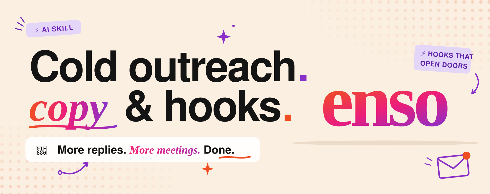

# Cold outreach playbook, as a Claude plugin

Cold outreach fails for one reason: the person on the other end doesn't know you. This plugin teaches Claude a complete system for earning a stranger's trust, so instead of a generic "here's a cold email" answer, you get an entire campaign built around your offer and the people you actually sell to.

Tell Claude what you sell, or just paste your website URL and let it work that out itself. The intake is five one-line questions in one message (what you sell, who buys it, your best proof, your channels, and what you could give away free — and a URL answers the first three for you), sensible defaults cover everything else, and then you get one document with everything in it:

- A target list plan: where the leads come from (scraping software, list brokers, or digging through communities by hand) and how to test a source with a few hundred leads before spending real money on it.
- A lead magnet, invented for you if you don't have one. Claude brainstorms 5 to 8 things you could give away free, scores them on a rubric, and picks the ones worth building. The bar: something so useful the prospect feels silly saying no.
- Hooks built as grab + gift pairs. The grab is the reason to contact this person now (they just raised, they're hiring, their website is visibly broken). The gift is the free thing. You get 5 to 10 per channel, ready to A/B test.
- The actual copy for every channel you use: cold email, social DM, a phone script with objection responses, SMS where consent allows. All of it written at a reading level a tired person can absorb in four seconds.
- A follow-up cadence (10 touches over 21 days by default) with real copy for every single touch, down to the breakup email. Most replies come from follow-up, so this is where campaigns are won.
- A scaling plan and a metrics table that tells you which number being low means which part is broken.
- A compliance checklist for CAN-SPAM, GDPR, CASL, TCPA, and platform rules.

Every line of copy runs through the bundled [ai-copywriter](https://github.com/mikiarlo3/ai-copywriter) skill, which writes reader-first and strips the phrases that make outreach smell like a template blast. "I hope this email finds you well" does not survive contact.

The deliverable is all or nothing on purpose. Whatever your channel mix, the skill won't stop at ideas or a lone email: it delivers the whole strategy end to end, from ICP to launch checklist, in one document you can start executing the same day.

## Install

**The lazy way: paste this repo's URL to your AI agent and say "install this".** This repo carries its own install protocol ([AGENTS.md](AGENTS.md)), so an agent that can read the URL knows what to do on its own harness: Claude Code installs the plugin via its CLI, agents with a shell run the one-line installer, and chat apps without a filesystem fetch the single-file bundle and follow it in the conversation, then tell you the one step that makes it permanent.

**The one-line way**, on any machine with a shell (auto-detects Claude Code, OpenClaw, OpenCode, and Codex, and installs into all of them):

```bash
curl -fsSL https://raw.githubusercontent.com/mikiarlo3/enso-ai-sdr/main/install.sh | bash
```

Everything here is plain Markdown, so it runs on any AI agent that can read instructions, the same way [ai-copywriter](https://github.com/mikiarlo3/ai-copywriter) does. Step-by-step tutorials for each platform live in [`docs/install/`](docs/install/):

| Where | How | Tutorial |
|---|---|---|
| Claude Code (CLI, desktop, claude.ai/code) | `/plugin` commands below | [docs/install/claude.md](docs/install/claude.md) |
| claude.ai chat app (web/mobile) | upload `dist/cold-outreach-playbook-skill.zip` in Settings → Capabilities → Skills, or use the bundle in a Project | [docs/install/claude.md](docs/install/claude.md) |
| ChatGPT | custom GPT or Project + `dist/cold-outreach-playbook-bundle.md` | [docs/install/chatgpt.md](docs/install/chatgpt.md) |
| Manus | Knowledge entry or per-task attachment | [docs/install/manus.md](docs/install/manus.md) |
| OpenClaw | copy skill folders into `~/.openclaw/skills/` | [docs/install/openclaw.md](docs/install/openclaw.md) |
| Hermes / self-hosted models | bundle as system prompt | [docs/install/hermes.md](docs/install/hermes.md) |
| Codex, Cursor, Gems, Poe, raw API, everything else | skills CLI or the bundle | [docs/install/other-agents.md](docs/install/other-agents.md) |

The two fast paths:

**Claude Code** (note: these commands exist only in Claude Code, not the claude.ai chat app):

```
/plugin marketplace add mikiarlo3/enso-ai-sdr
/plugin install cold-outreach-playbook@enso-ai-sdr
```

**Any skill-folder harness**, via the cross-agent [skills CLI](https://skills.sh):

```bash
npx skills add mikiarlo3/enso-ai-sdr --global
```

## Use

Ask naturally. The skill triggers on cold outreach topics:

> "Help me write a cold email sequence for my web design agency targeting dentists"

Or run the command for the full guided flow:

```
/outreach-campaign I sell a $2k/mo SEO retainer to local law firms
```

Claude asks whatever it still needs to know, then writes the campaign.

## What's inside

```
├── .claude-plugin/
│   ├── plugin.json               # plugin manifest
│   └── marketplace.json          # lets this repo act as a marketplace
├── AGENTS.md                     # guidance for AGENTS.md-aware harnesses
├── assets/
│   └── banner.svg
├── commands/
│   └── outreach-campaign.md      # /outreach-campaign slash command
├── dist/
│   ├── cold-outreach-playbook-bundle.md   # whole plugin as one file (ChatGPT, Manus, Gems, APIs)
│   ├── cold-outreach-playbook-skill.zip   # uploadable skill for claude.ai Settings → Skills
│   └── ai-copywriter-skill.zip
├── docs/
│   └── install/                  # per-agent install tutorials
├── install.sh                    # one-line installer (curl | bash)
├── scripts/
│   └── build-bundle.sh           # regenerates dist/ after skill edits
└── skills/
    ├── ai-copywriter/            # bundled copy sub-skill (mikiarlo3/ai-copywriter)
    │   ├── SKILL.md
    │   └── references/
    │       └── linkedin-virality.md
    └── cold-outreach-playbook/
        ├── SKILL.md                          # workflow + intake interview + definition of done
        ├── references/
        │   ├── list-building.md              # the 3 list methods + testing protocol
        │   ├── lead-magnet-generator.md      # gift + grab: magnet ideation, scoring, attention triggers
        │   ├── hooks-and-copy.md             # hook formulas, channel templates, banned phrases
        │   ├── follow-up-cadence.md          # cadence tables + copy angles per touch
        │   └── scaling-and-metrics.md        # scaling ramp, benchmarks, diagnostics, compliance
        ├── assets/
        │   └── playbook-template.md          # output document skeleton
        └── evals/
            └── evals.json                    # test prompts for skill iteration
```

## The method

The playbook underneath is simple, and the skill refuses to skip any of it. Make cold feel warm: research buys you the first few seconds a stranger never owes you. Give away something others charge for, up front, without teasing. Keep every message simple enough that nobody has to reread it. Then follow up more times than feels polite, across more channels than feels comfortable, because that's where the customers are. Start by hand, prove the message works, and only then automate. A script that works can run for years.
